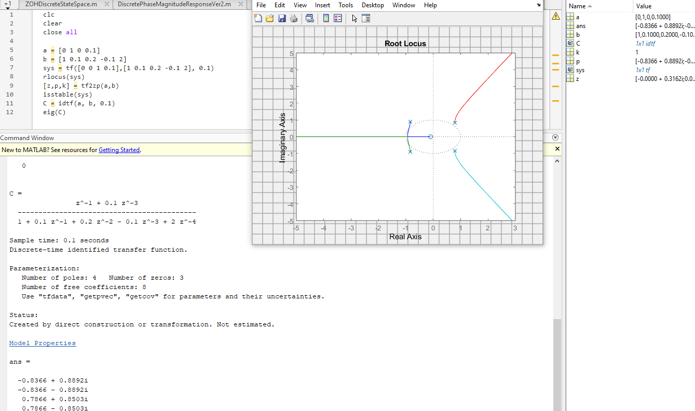

<br />
<div align="center">
  <h3 align="center">MATLAB Scripts</h3>
  <p align="center">
    MATLAB Scripts used mainly in numerical estimation, kinematics and digital control.
</div>

### Installation

1. Buy or download the trial version of [MATLAB](https://www.mathworks.com/products/matlab.html).
2. Clone the repo
   ```sh
   git clone https://github.com/DarioArzaba/MATLABScripts.git
   cd MATLABScripts
   ```
3. Open, edit and run any of the `m` files provided.
4. Some files require the [MATLAB Support Package for Arduino](https://www.mathworks.com/matlabcentral/fileexchange/47522-matlab-support-package-for-arduino-hardware)

</br>
<div align="center"> <p> Example of plant transfer function and root locus plot</p> </div>


</br>

* Note: Most files can be opened using the open source alternative [Octave](https://octave.org/download), however small code changes could be needed for example instead of using the function `angle` in MATLAB you would need to use `arg` function instead.

## License

Distributed under the [MIT License](https://mit-license.org/).

## Contact

Dario Arzaba - dario.arzaba@gmail.com